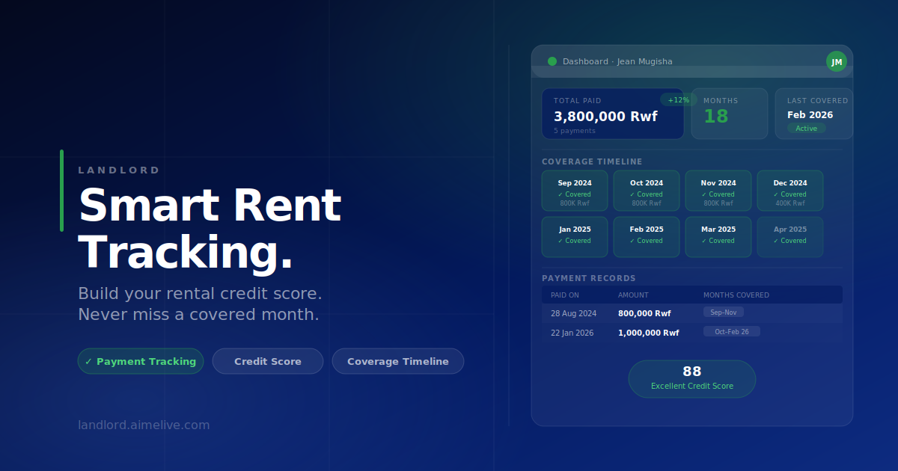

<div align="center" style="background:#ffffff; padding: 32px 0 16px;">
  
</div>

<br/>

<div align="center">

# LandLord · Rent Transactions

**A modern rent tracking and rental credit scoring platform for tenants and landlords.**

[](https://vuejs.org/)
[](https://www.typescriptlang.org/)
[](https://tailwindcss.com/)
[](https://vitejs.dev/)
[](https://web.dev/progressive-web-apps/)
[](https://landlord.aimelive.com)

</div>

---

## The Idea

Renting a home is one of the most significant financial commitments a person makes - yet it leaves almost no trace. Unlike a mortgage or a car loan, years of consistent, on-time rent payments are largely invisible to the financial system. Tenants build no verifiable track record, and landlords have no reliable way to assess a prospective tenant beyond a gut feeling or an informal reference.

**LandLord** was built to change that.

At its core, LandLord is a rent transaction dashboard - a place where every payment a tenant makes is logged, visualised, and turned into a portable rental history. Month by month, payment by payment, the platform builds a **rental credit score** that tenants own and can share. For landlords, it offers a clear, structured view of which tenants are covered, which months have been paid, and when the next payment is due.

The idea is simple: make rent payments as legible and meaningful as any other financial transaction.

---

## The Problem It Solves

| Pain Point                | Without LandLord                     | With LandLord                                       |
| ------------------------- | ------------------------------------ | --------------------------------------------------- |
| **Proof of payment**      | WhatsApp screenshots, paper receipts | Structured digital ledger with coverage timeline    |
| **Rental credit history** | Non-existent                         | Month-by-month score that grows with every payment  |
| **Coverage clarity**      | "Did I pay December?"                | Visual month grid - green = covered, instant answer |
| **Landlord trust**        | Informal references                  | Shareable, verifiable payment record                |
| **Rent chasing**          | Manual calls and messages            | Automated reminders, real-time dashboard            |

---

## Features

### For Tenants

- **Coverage Timeline** - A visual month grid showing every paid and unpaid month at a glance. Click any month to see the payment that covers it, the amount, date, and notes.
- **Payment Records** - A full ledger of every transaction: when it was paid, how much, what months it covered, and any notes from the landlord.
- **Rental Credit Score** - A live credit score (currently 88 · Excellent) derived from payment consistency and coverage completeness.
- **Payment Detail Drawer** - A slide-in panel revealing full payment details without leaving the page.
- **Year Filter** - Instantly narrow the timeline or table to any year.

### For Landlords

- Dashboard across all properties and tenants
- Automated rent reminders
- Tenant credit score verification before signing
- Covered month overview per tenant

## Architecture

### Tech Stack

| Layer     | Technology                                                          |
| --------- | ------------------------------------------------------------------- |
| Framework | Vue 3 - Composition API, `<script setup lang="ts">`                 |
| Language  | TypeScript 5.3 - strict mode, no unused variables                   |
| Styling   | Tailwind CSS v4 (via `@tailwindcss/vite`) + custom CSS              |
| Routing   | Vue Router 4 - nested routes, scroll behaviour, catch-all redirects |
| Icons     | Lucide Vue Next                                                     |
| Animation | `@vueuse/motion` for enter transitions                              |
| Phone     | `libphonenumber-js` - 240+ countries, format validation             |
| SEO       | Custom `useSeo.ts` composable - zero dependencies, direct DOM       |
| PWA       | `vite-plugin-pwa` v1 + Workbox service worker                       |
| Build     | Vite 5                                                              |

### Project Structure

```
src/
├── assets/
│   └── styles.css              # Brand tokens, animations, utility classes
├── components/
│   ├── dashboard/
│   │   ├── layout/
│   │   │   ├── DashboardTopbar.vue   # h-16 topbar, credit score badge, avatar
│   │   │   └── DashboardSidebar.vue  # Light-theme nav with notification badges
│   │   ├── MonthGrid.vue             # Coverage month cards grid
│   │   ├── PaymentDetail.vue         # Slide-in payment detail drawer
│   │   ├── PaymentsTable.vue         # Tabular ledger with expandable rows
│   │   ├── SummaryCards.vue          # Hero stat cards (navy + white)
│   │   └── YearFilter.vue            # Year button group filter
│   └── home/
│       ├── NavBar.vue                # Sticky navigation with smooth scroll anchors
│       ├── HeroSection.vue           # Above-the-fold with animated mesh orbs
│       ├── StatsStrip.vue            # Social proof numbers
│       ├── FeaturesGrid.vue          # Product feature cards
│       ├── HowItWorks.vue            # Step-by-step explainer
│       ├── DashboardPreview.vue      # Perspective-tilted dashboard mockup
│       ├── CreditScoreSection.vue    # Credit score visualisation
│       ├── BeforeAfter.vue           # Comparison: life before vs after LandLord
│       ├── TenantDashboard.vue       # Tenant-facing preview component
│       ├── ValueProp.vue             # Core value proposition section
│       ├── CtaBanner.vue             # Call-to-action banner
│       └── FooterSection.vue         # Footer with links and legal
├── composables/
│   └── useSeo.ts               # Lightweight per-page SEO head manager
├── data/
│   └── rentTransactions.ts     # Mock payment ledger (Rwf, 5 payments)
├── lib/
│   └── ledger.ts               # Pure utility functions for payment logic
├── pages/
│   ├── LandingPage.vue
│   ├── LoginPage.vue
│   ├── SignupPage.vue
│   └── dashboard/
│       ├── DashboardLayout.vue       # Shared chrome (topbar + sidebar)
│       ├── DashboardPage.vue
│       ├── CoverageTimelinePage.vue
│       └── PaymentRecordsPage.vue
├── router/
│   └── index.ts                # Route definitions, scroll behaviour
├── App.vue
└── main.ts
```

### Routing - Nested Layout Pattern

The dashboard uses Vue Router's nested route pattern. `DashboardLayout.vue` is the parent route component; it renders the topbar and sidebar once and uses `<RouterView />` for child page content. This eliminates duplication across dashboard pages and ensures the sidebar state (`sidebarOpen`) is owned at the layout level.

```
/dashboard → DashboardLayout (topbar + sidebar)
  ""        → DashboardPage
  coverage  → CoverageTimelinePage
  payments  → PaymentRecordsPage
  *         → redirect /dashboard
```

### SEO Strategy

LandLord is a client-side-rendered Vue SPA. To serve crawlers correctly:

- **Static fallbacks** in `index.html` are read by bots parsing raw HTML
- **Dynamic `useSeo.ts`** composable updates the DOM on every client-side navigation
- **Dashboard pages** carry `noindex, nofollow` - they are private and should not be indexed
- **Auth pages** (`/login`, `/signup`) are indexed - they help with discoverability
- **JSON-LD** structured data (SoftwareApplication, FAQPage, Organization, WebSite) is injected per-page and cleaned up on unmount

### PWA

The app is fully installable as a Progressive Web App:

- **Manifest**: `name`, `short_name`, `display: standalone`, `theme_color: #031a60`
- **Service worker**: auto-update via Workbox, CacheFirst for fonts, NetworkFirst for pages
- **Icons**: SVG at 192×192 and 512×512, PNG fallbacks
- **iOS**: `apple-mobile-web-app-capable`, `viewport-fit=cover`, `black-translucent` status bar, splash screens for 6 iPhone/iPad sizes

---

## Brand

| Token     | Value     | Usage                                        |
| --------- | --------- | -------------------------------------------- |
| Navy      | `#031a60` | Primary - headers, CTA, landlord accent      |
| Green     | `#299f4d` | Secondary - tenant accent, success, coverage |
| Dark Navy | `#04091e` | Deep backgrounds                             |
| Silver    | `#dce1e9` | Borders, dividers                            |
| Muted     | `#a8adc1` | Secondary text, placeholders                 |
| Navy Dark | `#1a2847` | Label text                                   |

Font: **Outfit** - weights 400 · 500 · 600 · 700 · 800

---

## Getting Started

### Prerequisites

- Node.js ≥ 18
- npm ≥ 9

### Install & Run

```bash
# Clone the repo
git clone https://github.com/aimelive/landlord.git
cd landlord

# Install dependencies
npm install

# Start development server
npm run dev
```

Open [http://localhost:5173](http://localhost:5173) in your browser.

### Build for Production

```bash
npm run build
```

Type checking runs automatically before the build via `vue-tsc`. Output goes to `dist/`.

### Preview Production Build

```bash
npm run preview
```

---

## Live

> **[https://landlord.aimelive.com](https://landlord.aimelive.com)**

---

<div align="center">
  <br/>
  
  <br/><br/>
  <sub>Built with clarity · &copy; 2026 LandLord</sub>
</div>
